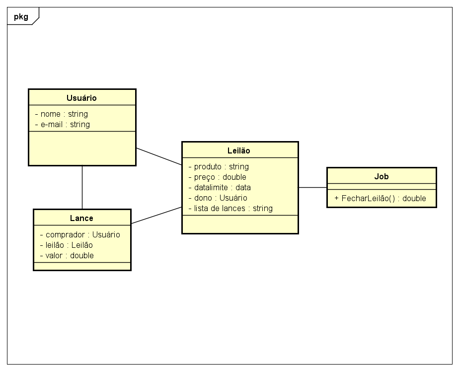

Um leiloeiro contratou nossa turma de POO II para desenvolver um sistema de leilões que tem a seguinte modelagem:

Diagrama de Classe Leilão | UML: modelagem de soluções | Alura - Cursos  online de tecnologia

Proponha um projeto usando a arquitetura MVC e modele as entidades principais (Lance, Leilão e Usuário) usando o Prisma ORM. Criem uma camada de rotas, controladores e serviços para as três entidades.

Ao final do projeto, subam o resultado para o Github e postem aqui o link com o projeto público de vocês.

Bom trabalho!

Otávio
